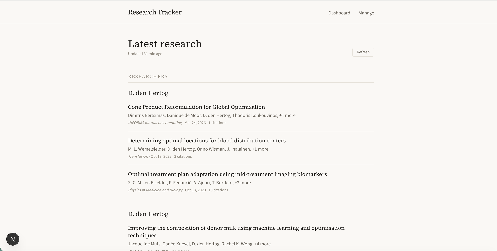
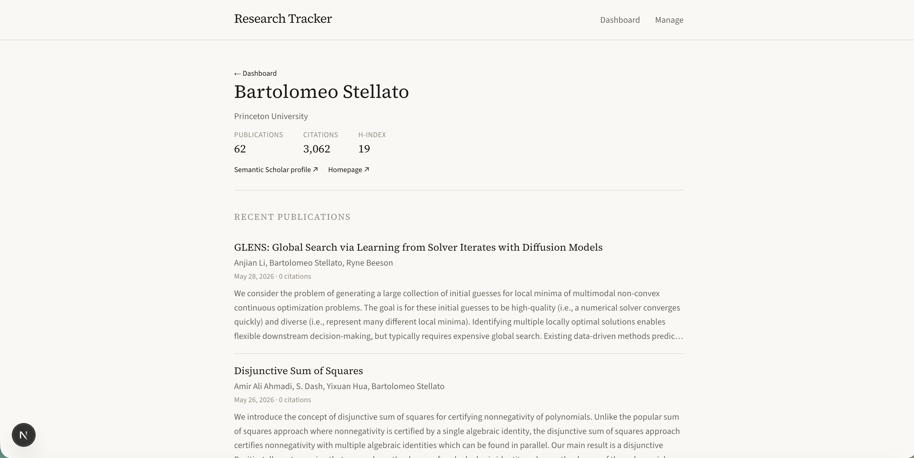
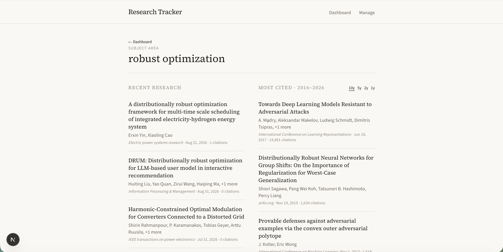
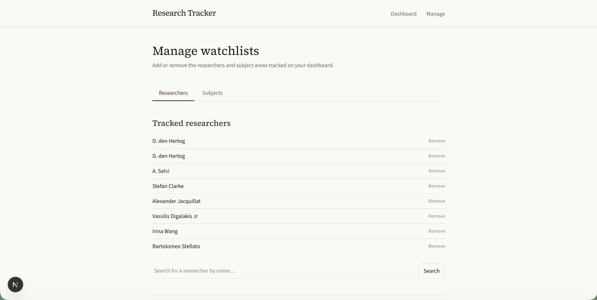

Local web app designed to track publications from researchers and subject areas of interest.

This is a [Next.js](https://nextjs.org) project bootstrapped with [`create-next-app`](https://nextjs.org/docs/app/api-reference/cli/create-next-app).

A local, single-user web app that surfaces the latest publications from a personal watchlist of
**researchers** and **subject areas**, built on the
[Semantic Scholar Academic Graph API](https://www.semanticscholar.org/product/api). Minimalist
academic aesthetic, server-side API proxy with rate limiting and caching.

> _Built with Next.js (App Router), TypeScript, Tailwind CSS, and SQLite._

## Screenshots

| Dashboard | Researcher profile |
| --- | --- |
|  |  |

| Subject area | Manage watchlists |
| --- | --- |
|  |  |

<!-- Drop PNGs into docs/screenshots/ with the filenames above. -->

## Features

- **Dashboard** — the latest 3 publications from each watched researcher and subject area, at a glance.
- **Researcher pages** — profile metrics (affiliation, h-index, citation count, paper count,
  homepage) plus a fuller publication list.
- **Subject pages** — recent research alongside the most-cited papers, with a
  **10 / 5 / 2 / 1-year** filter on the citation window.
- **Manage** — add/remove researchers and topics, search Semantic Scholar for people or subjects
  before committing them, and get heuristic recommendations (related researchers via co-authorship;
  related subjects via shared field tags).
- **Resilient by design** — one rate-limited request degrades a single section gracefully instead
  of taking down the page, with a route-level error boundary as a backstop.

## Tech stack

| Layer | Choice |
| --- | --- |
| Framework | Next.js (App Router) + React, TypeScript |
| Styling | Tailwind CSS — restrained academic palette, serif headings |
| Storage | SQLite via `better-sqlite3` (watchlists + response cache) |
| Data | Semantic Scholar Academic Graph API |

## Setup

1. Request an API key at <https://www.semanticscholar.org/product/api#api-key>.
2. Create your env file and add the key:
   ```bash
   cp .env.example .env.local
   # edit .env.local:
   # SEMANTIC_SCHOLAR_API_KEY=your-key-here
   ```
3. Install dependencies:
   ```bash
   npm install
   ```
4. _(Optional)_ Seed the watchlist with a few leading ML researchers and subject areas:
   ```bash
   npm run seed
   ```
5. Run the dev server:
   ```bash
   npm run dev
   ```
6. Open <http://localhost:3000>. If you skipped seeding, head to **Manage** to add researchers and
   subjects.

> The key is only read at startup — restart the dev server after editing `.env.local`.

## How it works

- All Semantic Scholar calls run **server-side** (route handlers in `app/api`), so the API key
  never reaches the browser.
- A shared request queue (`lib/rateLimiter.ts`) serializes calls to respect the **1 request/second**
  limit, honoring the server's `Retry-After` header and backing off exponentially on HTTP 429.
- Responses are cached in a local SQLite database (`data/tracker.db`, gitignored) with a ~24h TTL
  (`lib/cache.ts`), so the dashboard loads instantly. The **Refresh** button clears the cache and
  re-fetches in the background.
- The dashboard fetches each researcher/subject section independently and falls back to stale cache
  on failure, so a transient rate limit never blanks the whole page.

## Project structure

```
app/
  page.tsx              Dashboard
  researcher/[id]/      Researcher profile + publications
  subject/[id]/         Subject: recent + most-cited (year-filterable)
  manage/               Edit watchlists, search, recommendations
  api/                  Server-side Semantic Scholar proxy + watchlist CRUD
  error.tsx             Route-level error boundary
lib/
  semanticScholar.ts    Typed Semantic Scholar client
  rateLimiter.ts        1 req/s queue + 429 backoff
  cache.ts              TTL cache over SQLite
  db.ts                 SQLite schema + watchlist queries
  data.ts               Cached service layer / dashboard assembly
  recommendations.ts    Heuristic related researchers & subjects
components/             Shared UI (publication list, refresh button)
scripts/seed.mjs        Optional watchlist seed
```

## Notes & limitations

- Researcher "background" is metrics + affiliation + homepage; Semantic Scholar exposes no prose bio.
- Recommendations are heuristic — there is no official author/subject recommendation endpoint.
  Related-subject suggestions come from Semantic Scholar's coarse field tags and are approximate.
- Subjects are free-text queries; multi-word topics are phrase-matched and relevance-filtered.
- Designed for **local, single-user** use. Watchlists and cache live in a local SQLite file.
